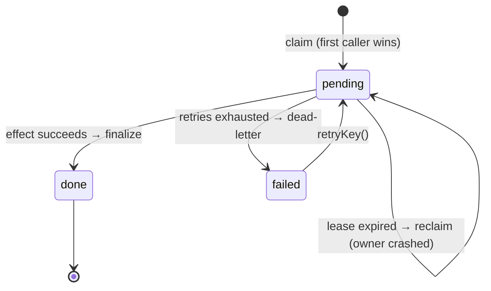

<p align="center">
  
</p>

<p align="center">
  <a href="https://www.npmjs.com/package/oncekit"></a>
  <a href="https://github.com/shrivats2/oncekit/actions"></a>
  
  <a href="./LICENSE"></a>
</p>

Your webhook handler **will** be called twice. Your queue **will** redeliver. Your retry **will** fire after the work already happened. Nearly every messaging and webhook system on earth is _at-least-once_ — Stripe, SQS, Kafka, EventBridge, GitHub — and they all tell you the same thing in the docs: _"make your handler idempotent."_

That one sentence hides a surprising amount of correctness work: deduping keys, protecting against concurrent redelivery, recovering work that crashed half-done, and giving up gracefully on things that will never succeed. `oncekit` is that work, in one call.

```ts
const result = await once.run(event.id, async () => {
  await chargeCard(event);      // runs at most once per event.id, ever
  return { charged: true };
});
// result.status → "executed" | "duplicate" | "in_flight" | "dead_letter"
```

- ✅ **Deduplication** — the effect runs once per key; duplicates get the cached result back.
- ✅ **Concurrency-safe** — a burst of simultaneous redeliveries produces exactly one execution.
- ✅ **Crash recovery** — work whose worker died mid-flight is taken over and finished, not lost or double-run.
- ✅ **Dead-lettering** — permanently failing work stops retrying and lands somewhere you can see and replay it.
- ✅ **Zero-dependency core** — the in-memory store ships with nothing. Postgres is one import away. Bring your own store with ~7 methods.
- ✅ **Typed, small, honest** — full TypeScript, and a [design doc](docs/design.md) that tells you exactly what "exactly-once" does and doesn't mean.

## Install

```bash
npm i oncekit
```

## Quickstart

```ts
import { createProcessor, MemoryStore } from "oncekit";

const once = createProcessor({ store: new MemoryStore() });

// e.g. inside an Express webhook route
app.post("/webhooks/stripe", async (req, res) => {
  const event = req.body;

  const result = await once.run(event.id, async () => {
    await fulfillOrder(event);          // your side effect
    return { fulfilled: true };
  });

  // Duplicate deliveries are a no-op that returns the original result.
  res.json(result);
});
```

Swap `MemoryStore` for the Postgres store and the exact same code is durable across restarts and processes:

```ts
import { createProcessor } from "oncekit";
import { PostgresStore } from "oncekit/postgres";
import { Pool } from "pg";

const store = new PostgresStore(new Pool());
await store.migrate(); // once, or manage the table with your own migrations

const once = createProcessor({ store });
```

## How it works

Every key moves through a small state machine. A **claim** is atomic — two workers racing for the same key can never both win.



- **Reserve.** The first caller to `claim` a key writes a `pending` row with a time-boxed *lease* and owns it. Everyone else sees `done`, `failed`, or `in_flight`.
- **Finalize.** When the effect succeeds, the result is cached under the key. Later callers get it back without re-running anything.
- **Reconcile.** If the owner crashes before finalizing, its lease eventually expires. The next caller *reclaims* the key and runs the effect — so nothing is silently lost, and nothing double-runs while a live owner still holds the lease.

## API

```ts
const once = createProcessor({
  store,                 // required: MemoryStore | PostgresStore | your own
  leaseMs: 30_000,       // how long a claim is held before takeover
  retry: { maxAttempts: 3, baseMs: 100, factor: 2, maxMs: 5_000, jitter: true },
  onDeadLetter: (info, err) => alert(info),  // called when a key is dead-lettered
  waitForInFlight: false // if true, duplicates wait for the owner and return its result
});

await once.run(key, effect);        // the main call
await once.inspect(key);            // current stored state, or undefined
await once.deadLetters(limit?);     // list dead-lettered keys, oldest first
await once.retryKey(key, effect);   // clear state and re-process
await once.forget(key);             // drop a key (TTL / cleanup)
```

`run` resolves to `{ status, result?, error?, attempts }`, where `status` is one of `executed`, `recovered`, `duplicate`, `in_flight`, or `dead_letter`.

## The honest part: what "exactly-once" really means

True exactly-once execution of an *arbitrary* side effect is impossible — if your process can crash at any instant, it can crash in the one-instruction gap between "did the work" and "recorded that I did the work." Anyone who tells you otherwise is selling something.

What oncekit actually gives you is **effectively-once**: it removes the duplicates you *can* remove (redelivery, concurrency, benign retries) and bounds the ones you can't (a crash strictly between effect and finalize). To make it truly once-and-only-once, close that gap by writing your effect and the finalize in **the same transaction**:

```ts
// Real exactly-once for a database effect: the write and the "done" marker
// commit together, or not at all.
await once.run(event.id, async () => {
  await db.transaction(async (tx) => {
    await tx.insert(orders).values(order);   // your effect
    // finalize participates in the same tx via a transactional store
  });
});
```

For effects that *can't* be transactional (charging a card, sending an email), keep the provider's own idempotency key aligned with your oncekit key — then a reclaim after a crash is safe, because the provider dedupes the retry. The [design doc](docs/design.md) walks through each failure window in detail.

## Stores

| Store | Durable | Cross-process | Dependencies | Use for |
| --- | --- | --- | --- | --- |
| `MemoryStore` | no | no | none | tests, single-process apps, demos |
| `PostgresStore` | yes | yes | `pg` (peer) | the common durable case; true exactly-once via transactional finalize |
| `RedisStore` | yes* | yes | `ioredis` (peer) | high-throughput dedup where the store is the bottleneck |
| _your own_ | — | — | — | DynamoDB, Mongo, … |

```ts
// oncekit/redis — atomic claim via a Lua script; the key TTL doubles as the lease.
import { RedisStore } from "oncekit/redis";
import Redis from "ioredis";
const once = createProcessor({ store: new RedisStore(new Redis()) });
```

<sub>*Redis is durable **only if you run it as a data store, not a cache** — AOF persistence on, no key eviction. See [Performance & choosing a store](#performance--choosing-a-store).</sub>

A store is ~7 methods (`claim`, `finalize`, `markFailed`, `extendLease`, `get`, `listDeadLetters`, `remove`). The only real requirement is that **`claim` is atomic**. See [`src/store.ts`](src/store.ts).

## Performance & choosing a store

The honest version, because "which store is fastest?" has a real answer and a real catch.

**The dedup bookkeeping is rarely your bottleneck.** oncekit adds one claim + one finalize per key — single-key, indexed operations, ~1–4ms on Postgres including a round trip. The effect you're wrapping (charge a card, send an email, write an order) is almost always 10–500ms. The overhead is a rounding error, and you'll hit your effect, your provider's rate limits, or your connection pool long before the store is the limit.

**So pick for correctness first, speed second:**

- **`PostgresStore` — the right default.** You probably already run it, it's durable, and it's the only store that can give you *true* exactly-once: put the finalize in the **same transaction** as a database effect and the crash window disappears entirely (see [design notes](docs/design.md)). At webhook/event throughput this is plenty fast.
- **`RedisStore` — reach for it at high throughput** (tens of thousands of dedup ops/sec) with idempotent or non-transactional effects. In-memory and a single atomic Lua claim, so it's genuinely faster per op. But: run it as a **durable data store** (AOF on, eviction off) — a cache that *evicts* your "done" record will happily let a duplicate re-run, which for an idempotency store is a correctness bug, not a cache miss. And it can't do transactional finalize with a SQL effect, so you're at "effectively once," not "exactly once."
- **`MemoryStore` — never for durability.** It can't survive the crash it's meant to recover from.

Rule of thumb: **Postgres for correctness, Redis for throughput.** Different points on the same speed↔durability curve — which is why the store is pluggable.

## Roadmap

- [ ] Transactional finalize helper for the Postgres store (true exactly-once in one call)
- [ ] Automatic key TTL / retention sweeper for the SQL store
- [ ] Batch `run` for high-throughput consumers

## License

MIT © [Shrivats Shrivastav](https://github.com/shrivats2)
